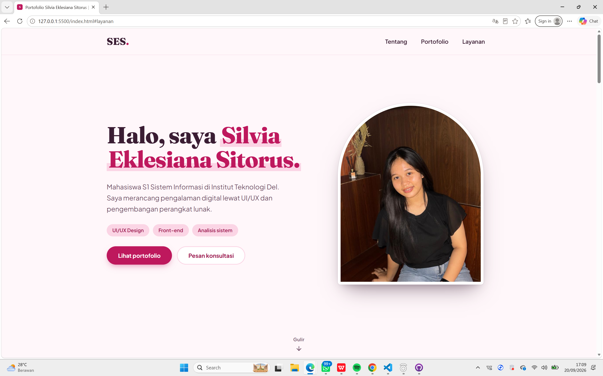
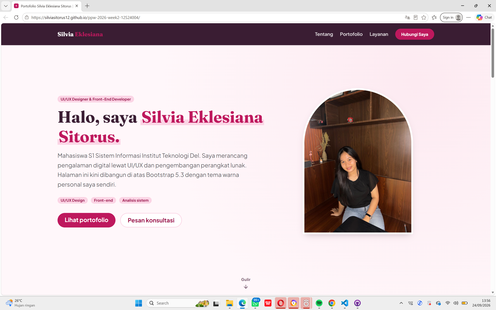
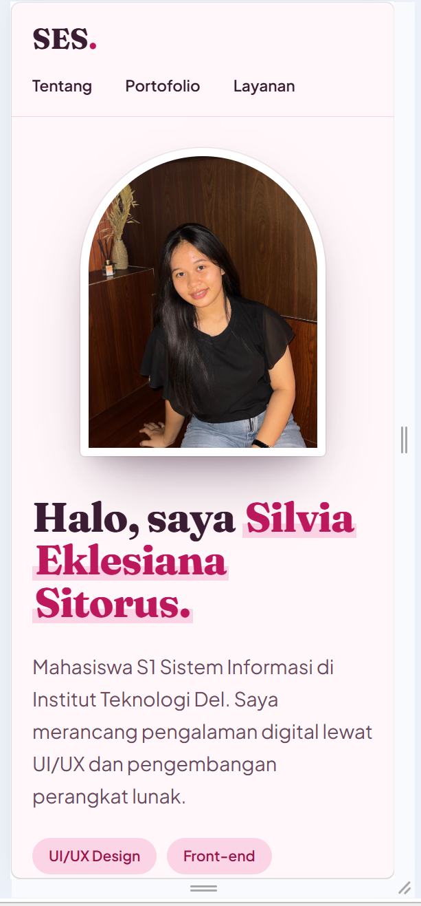
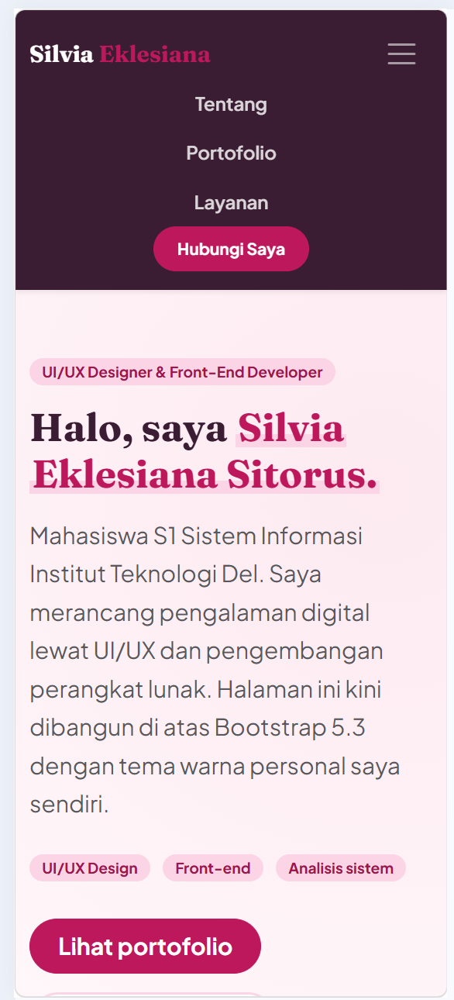

# Portofolio Silvia Eklesiana Sitorus — Minggu 3 (Bootstrap 5)

Modernisasi dan refactoring **Personal Portfolio & Service Portal** dari Minggu 2, kini
dibangun di atas **Bootstrap 5.3** dan **Custom CSS Overrides**, untuk mata kuliah
**Pemrograman dan Pengujian Aplikasi Web (12S3101)**, Institut Teknologi Del.

Proyek ini adalah **refactoring**, bukan proyek baru: dikembangkan di branch `week3-bootstrap`
pada repositori Minggu 2 yang sama, sesuai ketentuan tugas.

| | |
|---|---|
| **Nama** | Silvia Eklesiana Sitorus |
| **NIM** | 12S24004 |
| **Kelas** | S1 Sistem Informasi |
| **Live demo** | https://silviasitorus12.github.io/ppw-2026-week2-12S24004/ *(tampil setelah GitHub Pages diarahkan ke branch `week3-bootstrap`, lihat bagian Deployment)* |
| **Repositori — branch Minggu 3** | https://github.com/SilviaSitorus12/ppw-2026-week2-12S24004/tree/week3-bootstrap |
| **Repositori — branch Minggu 2 (`main`, tidak diubah)** | https://github.com/SilviaSitorus12/ppw-2026-week2-12S24004 |

## Tampilan

| Sebelum (Minggu 2) | Sesudah (Minggu 3) |
|---|---|
|  |  |
|  |  |

## Ringkasan Pembaruan

Halaman ini tetap mempertahankan **identitas dan struktur semantik HTML5** dari Minggu 2
(`header`, `nav`, `main`, `section`, `article`, `aside`, `footer`), lalu direfaktor untuk
memakai sistem grid dan komponen Bootstrap 5, ditimpa tema warna personal lewat `style.css`.

## Tabel Komparasi: Sebelum vs Sesudah Integrasi Framework

| Aspek | Sebelum (Minggu 2 — CSS murni) | Sesudah (Minggu 3 — Bootstrap 5.3) |
|---|---|---|
| **Tata letak** | `display: grid` dan `display: flex` kustom di `style.css` | Sistem grid 12-kolom Bootstrap: `row row-cols-1 row-cols-md-2 row-cols-lg-3 g-4` |
| **Navigasi** | `<header>` statis dengan `<nav>` sederhana, tanpa menu mobile | `navbar navbar-expand-lg navbar-dark sticky-top` dengan tombol hamburger (`navbar-toggler` + `collapse`) yang berfungsi penuh di ponsel |
| **Kartu proyek** | Kartu `<article class="card">` kustom, tautan langsung ke Figma/GitHub | Kartu Bootstrap (`.card`, `.ratio`, `.badge`) + **Bootstrap Modal** untuk 2 proyek (GLOBORA, Imuniku) yang menampilkan detail tanpa berpindah halaman |
| **Formulir** | `<input class="form-control">` kustom dengan `<label>` di atas input | **Floating Labels** (`.form-floating`), **Input Group** berikon Bootstrap Icons, serta umpan balik validasi visual (`.is-valid` / `.is-invalid`, `.valid-feedback` / `.invalid-feedback`) |
| **Menu aktif saat digulir** | Skrip `IntersectionObserver` buatan sendiri di `script.js` | Fitur bawaan **Bootstrap Scrollspy** (`data-bs-spy="scroll"` pada `<body>`), tanpa satu baris JavaScript kustom |
| **Responsivitas** | Satu breakpoint kustom `@media (max-width: 768px)` | Breakpoint Bootstrap berjenjang: `sm` (≥576px), `md` (≥768px), `lg` (≥992px), `xl` (≥1200px) |
| **Ikon** | SVG inline buatan sendiri | Paket **Bootstrap Icons** via CDN (`bi bi-envelope`, `bi bi-telephone`, dst.) |
| **Tema warna** | Custom property di `:root`, dipakai langsung di selector kustom | Custom property yang sama, kini **dipetakan ke variabel Bootstrap** (`--bs-primary`, `--bs-link-color`, dst.) agar seluruh komponen Bootstrap otomatis mengikuti tema personal |
| **Berkas kode** | `index.html`, `style.css`, `script.js` (tiga berkas) | `index.html` dan `style.css` saja. `style.css` dimuat **setelah** `bootstrap.min.css` (CDN) agar override berjalan tanpa `!important`. Tidak ada `script.js` lagi — validasi formulir memakai delapan baris skrip resmi dari dokumentasi Bootstrap, ditulis inline di `index.html` |

## Pemenuhan Spesifikasi Tugas Minggu 3

| Area evaluasi (bobot) | Implementasi |
|---|---|
| **Fondasi framework & semantik (15%)** | Bootstrap 5.3.3 CSS + JS Bundle dan Bootstrap Icons via CDN; struktur semantik HTML5 tetap utuh; `meta viewport` valid; `style.css` dimuat setelah Bootstrap |
| **Responsive navbar & hero (20%)** | Navbar `sticky-top` dengan brand identity; tombol hamburger berfungsi tanpa error console; Hero Section satu layar penuh dengan CTA ganda dan petunjuk gulir |
| **Grid portofolio & modal (20%)** | 5 kartu proyek dalam grid `row-cols-1 row-cols-md-2 row-cols-lg-3 g-4`; tiap kartu memuat banner, badge teknologi, deskripsi, dan tombol seragam; 2 modal dengan konten berbeda (GLOBORA, Imuniku) |
| **Modernisasi formulir (15%)** | Floating Labels untuk nama, jenis layanan, target, dan pesan; Input Group berikon untuk email dan telepon; select kategori; checkbox syarat; validasi visual lewat pola resmi Bootstrap `needs-validation` |
| **Custom overrides & theming (15%)** | 9 variabel CSS pada `:root`; palet warna personal (plum, rose, blush); mikro-interaksi hover pada kartu dan tombol; **nol** penggunaan `!important` |
| **Git & deployment (15%)** | Branch `week3-bootstrap` dari repo Minggu 2 (branch `main` tidak diubah); README ini memuat tabel komparasi dan screenshot; terpublikasi di GitHub Pages |

## Struktur Folder

```
ppw-2026-week2-12S24004/            (repositori, branch week3-bootstrap)
├── index.html
├── style.css
├── README.md
├── assets/                         (dipakai bersama dengan branch main)
│   ├── profile.jpeg
│   ├── globora.png / imuniku.png / labersa.png / dummymine.jpg / nextstep.png
│   └── sertifikat-*.pdf / .png
└── screenshots/
    ├── sebelum-desktop.png / sebelum-mobile.png
    └── sesudah-desktop.png / sesudah-mobile.png
```

## Menjalankan di Komputer Lokal

1. Clone repositori, lalu pindah ke branch ini: `git checkout week3-bootstrap`.
2. Buka folder di Visual Studio Code.
3. Klik kanan `index.html` → **Open with Live Server**.

Bootstrap, Bootstrap Icons, dan Google Fonts dimuat lewat CDN, sehingga koneksi internet
diperlukan agar tampilan sesuai rancangan.

## Deployment

```bash
cd ppw-2026-week2-12S24004
git checkout -b week3-bootstrap
git add .
git commit -m "feat(week3): refactor portfolio to bootstrap 5 grid and modern components"
git push -u origin week3-bootstrap
```

Lalu di GitHub: **Settings → Pages → Branch: `week3-bootstrap` → Save**. Alamat live demo-nya
tetap sama seperti Minggu 2, isinya yang berganti mengikuti branch yang dipilih di sini.

## Catatan

- Halaman ini **tidak memiliki berkas `script.js`**. Satu-satunya JavaScript yang dipakai
  adalah delapan baris skrip validasi resmi dari
  [dokumentasi Bootstrap 5](https://getbootstrap.com/docs/5.3/forms/validation/#custom-styles),
  ditulis inline di `index.html`, fungsinya hanya menambahkan kelas `was-validated` agar
  kotak umpan balik validasi Bootstrap tampil. Navbar, modal, dan menu aktif saat digulir
  (Scrollspy) semuanya bawaan Bootstrap lewat atribut `data-bs-*`, tanpa JavaScript tambahan.
- Formulir konsultasi bersifat **simulasi**; data tidak dikirim ke server.
- Berkas ini tidak memakai `!important` sama sekali. Warna dasar navbar dan warna latar
  kartu/modal ditimpa lewat selector langsung (`.navbar`, `.card`), bukan lewat utilitas
  Bootstrap yang bertanda `!important` bawaan, dan aturan `prefers-reduced-motion` menimpa
  `:hover` yang sama persis sehingga menang lewat urutan cascade, bukan `!important`.
- Selama proses refactoring, ditemukan satu bug dari efek samping override tema: Bootstrap
  menghitung warna latar `.card` dan `.modal-content` dari `--bs-body-bg` secara internal,
  sehingga saat warna latar halaman diubah, warna kartu ikut berubah dan nyaris menyatu
  dengan latar. Diperbaiki dengan menyasar `.card`, `.modal-content`, dan `.dropdown-menu`
  secara langsung.

## Teknologi

HTML5, Bootstrap 5.3.3 (CDN), Bootstrap Icons 1.11.3 (CDN), CSS3 kustom (Custom Properties,
Flexbox, Grid), JavaScript minimal (delapan baris, validasi formulir resmi Bootstrap), Git,
GitHub Pages.