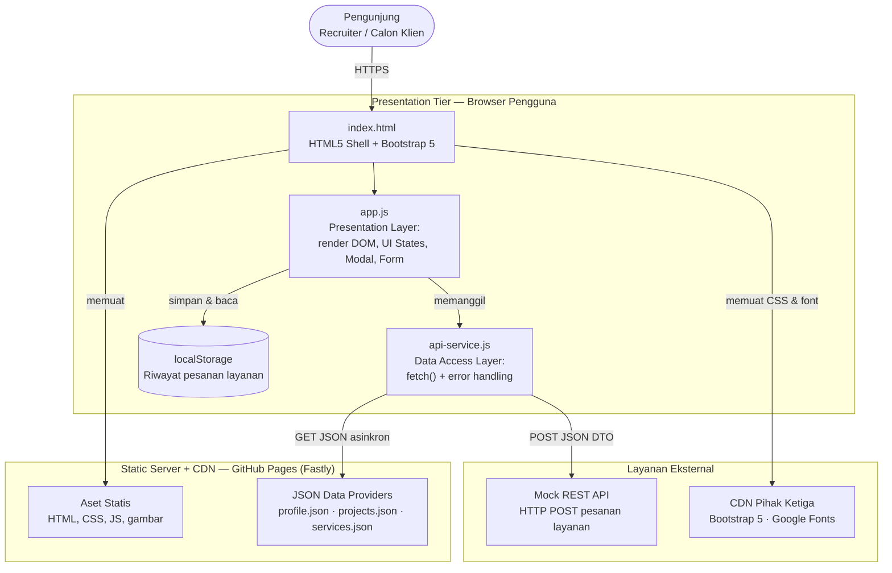
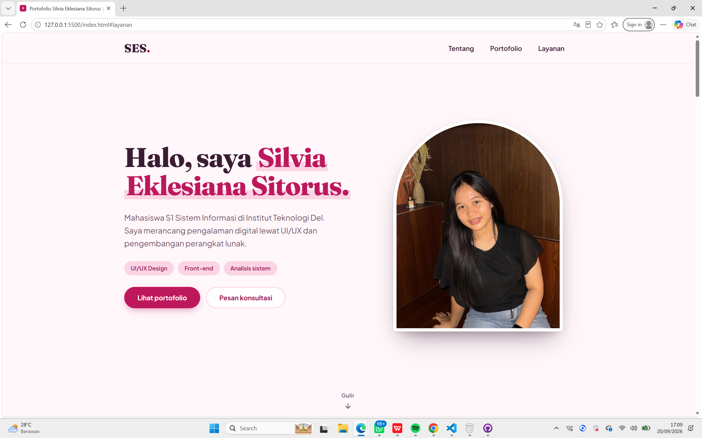
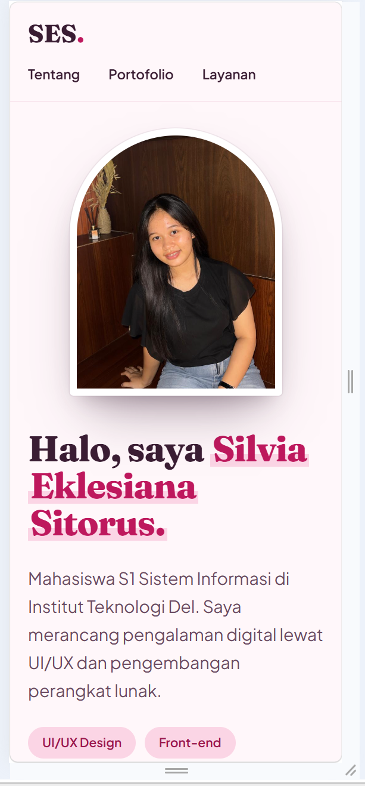
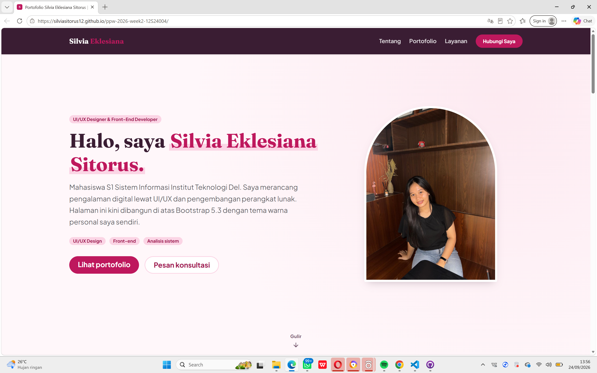
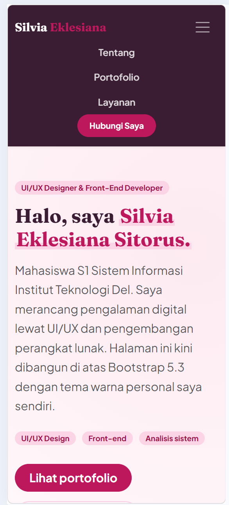
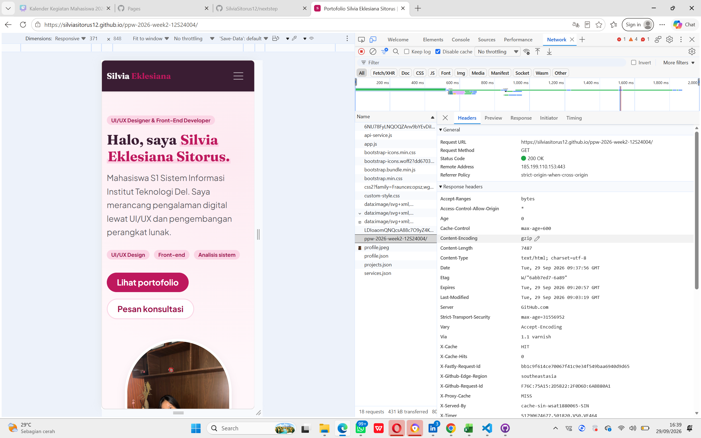
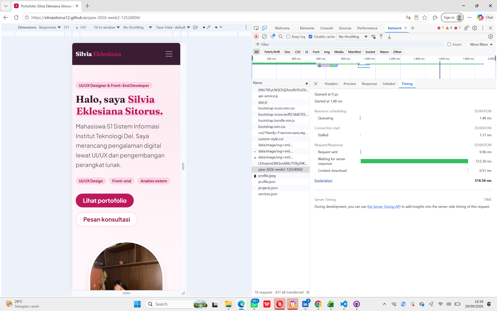
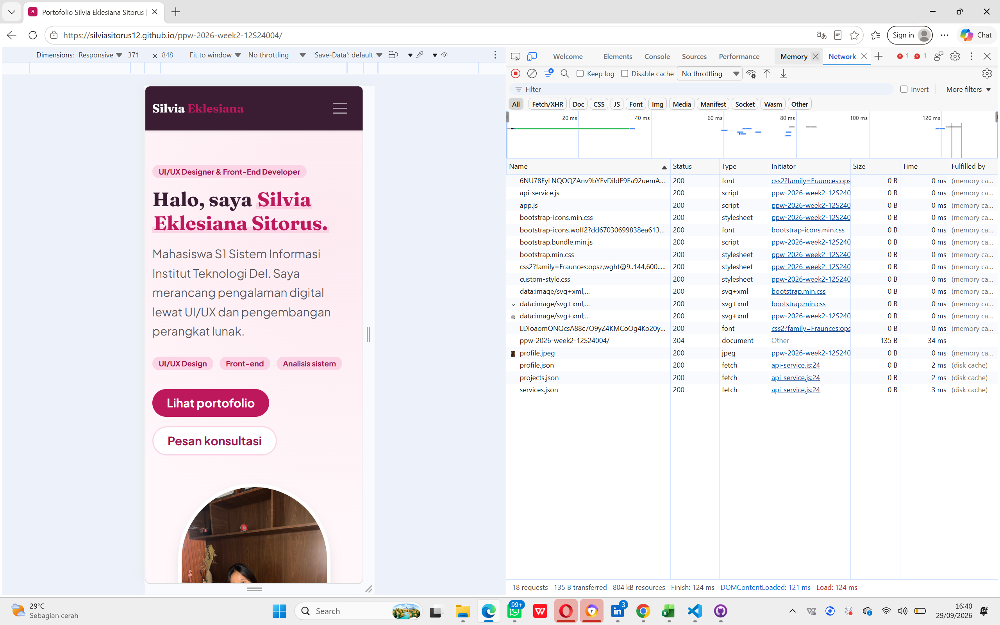
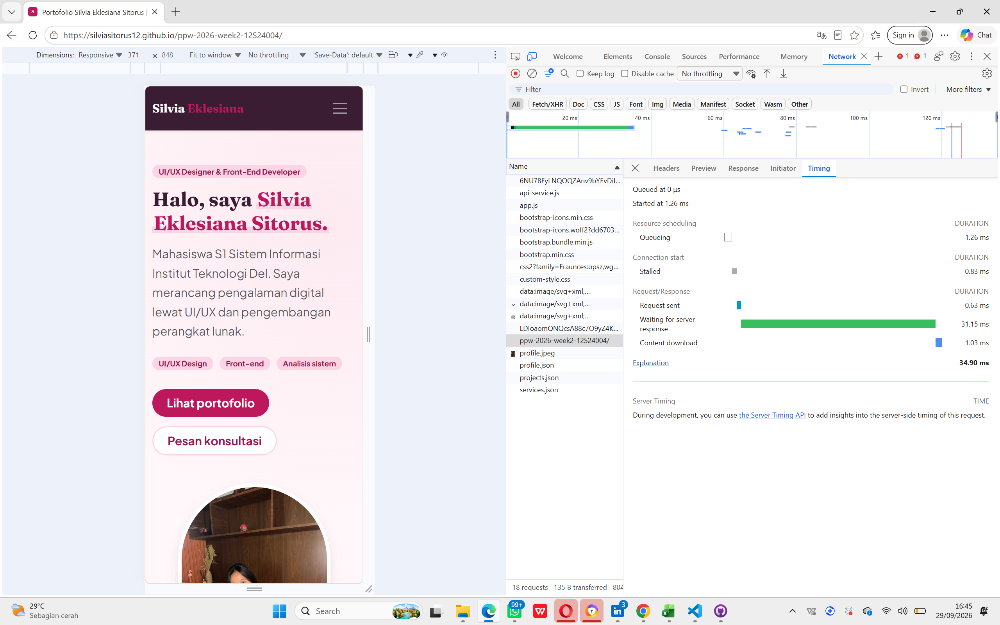
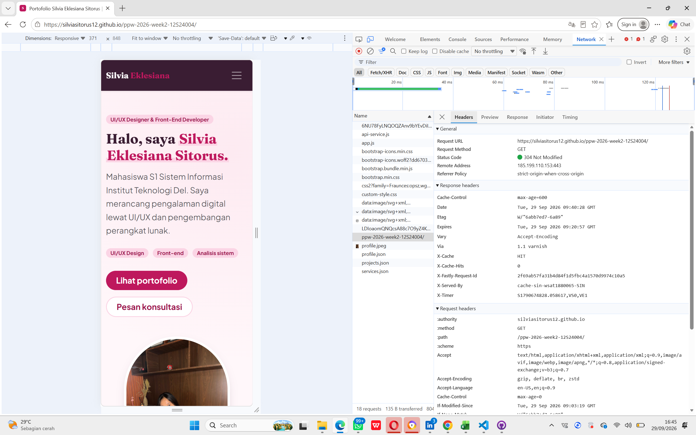

# Portofolio Silvia Eklesiana Sitorus — Week 4: Arsitektur Decoupled & Dynamic CSR

| Keterangan | Isi |
|---|---|
| Nama | Silvia Eklesiana Sitorus |
| NIM | 12S24004 |
| Program Studi | Sarjana Sistem Informasi — Institut Teknologi Del |
| Mata Kuliah | Pemrograman dan Pengujian Web (12S3101) |
| Branch | `week4-architecture` |
| Live Demo | https://silviasitorus12.github.io/ppw-2026-week2-12S24004/ |

Repositori ini merupakan kelanjutan tugas Minggu 3. Portofolio yang sebelumnya bersifat **monolitik statis** (seluruh kartu, modal, dan katalog layanan ditulis langsung di `index.html`) direfaktor menjadi aplikasi web berarsitektur **decoupled multi-tier** dengan **Dynamic Client-Side Rendering (CSR)**. Seluruh konten kini dimuat secara asinkron dari berkas JSON terpisah.

---

## 1. Diagram Arsitektur Sistem (C4 Container Model)


```mermaid
flowchart TB
    user(["Pengunjung<br/>Recruiter / Calon Klien"])

    subgraph client["Presentation Tier — Browser Pengguna"]
        html["index.html<br/>HTML5 Shell + Bootstrap 5"]
        app["app.js<br/>Presentation Layer:<br/>render DOM, UI States, Modal, Form"]
        api["api-service.js<br/>Data Access Layer:<br/>fetch() + error handling"]
        ls[("localStorage<br/>Riwayat pesanan layanan")]
    end

    subgraph hosting["Static Server + CDN — GitHub Pages (Fastly)"]
        static["Aset Statis<br/>HTML, CSS, JS, gambar"]
        json["JSON Data Providers<br/>profile.json · projects.json · services.json"]
    end

    subgraph external["Layanan Eksternal"]
        rest["Mock REST API<br/>HTTP POST pesanan layanan"]
        thirdcdn["CDN Pihak Ketiga<br/>Bootstrap 5 · Google Fonts"]
    end

    user -->|HTTPS| html
    html -->|memuat| static
    html -->|memuat CSS & font| thirdcdn
    html --> app
    app -->|memanggil| api
    api -->|GET JSON asinkron| json
    api -->|POST JSON DTO| rest
    app -->|simpan & baca| ls
```

### Pemetaan Lapisan (Multi-Tier)

| Tier | Komponen | Tanggung Jawab |
|---|---|---|
| **Presentation Tier** | `index.html`, `css/custom-style.css`, `js/app.js` | Menampilkan antarmuka, merakit DOM secara dinamis, mengelola UI States, modal, filter, dan interaksi formulir |
| **Application / Service Logic Tier** | `js/api-service.js`, Mock REST API | Menjadi satu-satunya pintu akses data: memanggil HTTP `fetch()`, memeriksa status respons, dan melempar error secara defensif |
| **Data Storage Tier** | `data/*.json`, `localStorage` | Menyimpan data profil, proyek, dan layanan sebagai *mock RESTful data layer*, serta riwayat pesanan di sisi klien |

### Narasi Pemisahan Minat (Separation of Concerns)

Arsitektur ini memisahkan tiga hal yang sebelumnya tercampur di satu berkas `index.html`: **data**, **logika akses data**, dan **tampilan**.

1. **Data dipisahkan dari tampilan.** Isi portofolio kini berada di `data/*.json`. Menambah atau mengubah proyek cukup dengan mengedit JSON, tanpa menyentuh HTML. Struktur ini meniru kontrak REST API sungguhan, sehingga kelak berkas JSON dapat diganti dengan *endpoint* backend tanpa mengubah lapisan tampilan.
2. **Akses data dipisahkan dari logika tampilan.** Seluruh pemanggilan `fetch()` terpusat di `api-service.js` (*Data Access Layer*). `app.js` tidak perlu tahu dari mana data berasal; ia hanya menerima data yang sudah siap dirender. Jika sumber data berubah, cukup satu berkas yang disesuaikan.
3. **Tampilan dirakit di sisi klien.** Server (GitHub Pages) hanya mengirim *HTML shell* dan berkas statis, sedangkan DOM dirakit di browser. Beban komputasi server menjadi sangat rendah dan aset dapat disajikan cepat dari CDN.

Pemisahan ini membuat kode lebih mudah dirawat, diuji per lapisan, dan dikembangkan ke arsitektur yang lebih besar.

### Komparasi Paradigma Arsitektur

| Parameter | Monolith SSR | CSR (proyek ini) | Jamstack |
|---|---|---|---|
| Perakitan DOM | Di server setiap request | Di browser via JavaScript | Saat *build* + data via API |
| Beban server | Tinggi | Sangat rendah (hanya kirim berkas) | Minimal (CDN edge) |
| TTFB | Menengah–lambat | Cepat (HTML shell kecil) | Sangat cepat |
| Navigasi | *Full page reload* | Mulus tanpa reload | Mulus dan reaktif |
| Hosting | Server aktif 24/7 | Static CDN (GitHub Pages) | Static CDN + serverless |

Proyek ini menerapkan **CSR di atas hosting statis ber-CDN**, sehingga sudah memiliki karakteristik utama Jamstack: aset disajikan dari edge server CDN dan data dimuat melalui kontrak JSON.

---

## 2. Struktur Direktori

```
ppw-2026-week2-12S24004/
├── index.html            # HTML shell bersih tanpa kartu hardcoded + 1 modal universal
├── assets/               # Foto profil, gambar proyek, sertifikat
├── css/
│   └── custom-style.css  # Custom styles, theming & CSS variables
├── data/
│   ├── profile.json      # Biodata dan statistik
│   ├── projects.json     # Koleksi proyek portofolio
│   └── services.json     # Katalog paket layanan
├── js/
│   ├── api-service.js    # Data Access Layer: fetch & error handling
│   └── app.js            # Presentation Layer: rendering, UI states, events
├── screenshots/          # Bukti tampilan dan hasil profiling DevTools
└── README.md
```

---

## 3. Implementasi Fitur

### 3.1 Dekomposisi Data Layer JSON

| Berkas | Isi |
|---|---|
| `profile.json` | Data diri: nama, peran, deskripsi, keahlian, statistik |
| `projects.json` | 4 proyek (GLOBORA, Imuniku, Labersa, NextStep) lengkap dengan kategori, deskripsi, peran, *tags*, gambar, dan tautan |
| `services.json` | Paket layanan beserta fitur dan tarif |

### 3.2 Dynamic CSR dan 4 UI States

Data dimuat secara asinkron dengan `async/await` melalui `api-service.js`, lalu dirender oleh `app.js`. Empat status antarmuka ditangani secara visual:

| UI State | Kapan Muncul | Tampilan |
|---|---|---|
| **Loading** | Saat data sedang diambil | Spinner / skeleton |
| **Success** | Data berhasil dimuat | Kartu proyek dan layanan dirender |
| **Empty** | Filter kategori tidak menemukan proyek | Pesan "belum ada proyek" |
| **Error** | Request gagal atau respons bukan 2xx | Alert peringatan defensif |

Filter kategori bekerja instan di sisi klien tanpa memuat ulang data dari server.

### 3.3 Universal Dynamic Modal

Hanya ada **satu** elemen modal di `index.html`. Tombol **Lihat detail** pada setiap kartu membawa `data-id`, lalu `app.js` mencari proyek yang sesuai dan menyuntikkan rinciannya ke modal melalui Bootstrap 5 Modal API (`bootstrap.Modal.getOrCreateInstance`). Tidak ada duplikasi elemen HTML untuk setiap proyek.

### 3.4 Decoupled REST Form dan State Lokal

- Formulir pemesanan layanan dikirim secara asinkron melalui `fetch()` dengan metode **HTTP POST** dan *payload* JSON, dengan `e.preventDefault()` sehingga tidak terjadi *full page reload*.
- Tombol submit dinonaktifkan dan menampilkan spinner selama proses pengiriman.
- Hasil pengiriman ditampilkan melalui **Bootstrap Toast**.
- Data pesanan disimpan di **localStorage** dan jumlahnya ditampilkan pada badge di antarmuka.

### 3.5 Keamanan Sisi Klien

**Pencegahan DOM-based XSS.** Nilai dinamis dirender menggunakan `textContent` atau melalui fungsi `escapeHTML()` sebelum dimasukkan ke `innerHTML`, sehingga karakter seperti `<`, `>`, `"`, dan `'` tidak dieksekusi sebagai kode.

**Rancangan Content Security Policy (CSP):**

```
default-src 'self';
script-src 'self' https://cdn.jsdelivr.net;
style-src 'self' https://cdn.jsdelivr.net https://fonts.googleapis.com;
font-src 'self' https://cdn.jsdelivr.net https://fonts.gstatic.com;
img-src 'self' data:;
connect-src 'self';
object-src 'none';
base-uri 'self';
```

| Direktif | Tujuan |
|---|---|
| `default-src 'self'` | Secara bawaan hanya mengizinkan sumber dari domain sendiri |
| `script-src` | Membatasi JavaScript hanya dari domain sendiri dan CDN Bootstrap |
| `style-src` / `font-src` | Mengizinkan CSS dan font dari CDN Bootstrap dan Google Fonts |
| `img-src 'self' data:` | Mengizinkan gambar lokal dan ikon SVG berbentuk `data:` dari Bootstrap |
| `connect-src` | Membatasi tujuan `fetch()`; tambahkan domain Mock REST API yang dipakai |
| `object-src 'none'` | Memblokir plugin seperti `<object>` dan `<embed>` |

---

## 4. Perbandingan Sebelum vs Sesudah Refactoring

| Aspek | Sebelum (Week 3) | Sesudah (Week 4) |
|---|---|---|
| Arsitektur | Monolitik statis dalam satu `index.html` | Decoupled multi-tier (data, akses data, tampilan terpisah) |
| Sumber data | Hardcoded di HTML | `data/profile.json`, `projects.json`, `services.json` |
| Rendering | HTML statis dari server | Dynamic CSR dengan `fetch()` + `async/await` |
| UI States | Tidak ada | Loading, Success, Empty, Error |
| Modal proyek | Satu modal terpisah untuk setiap proyek | Satu Universal Dynamic Modal berbasis `data-id` |
| Formulir layanan | Submit standar | Fetch POST asinkron + Toast, tanpa reload |
| Penyimpanan pesanan | Tidak ada | `localStorage` + badge jumlah pesanan |
| Keamanan | Belum ada penanganan khusus | Sanitasi XSS + rancangan CSP |
| Menambah proyek baru | Menyalin blok HTML kartu dan modal | Cukup menambah satu objek di `projects.json` |

**Tampilan Sebelum Refactoring**





**Tampilan Sesudah Refactoring**





---

## 5. Profil Kinerja Jaringan (DevTools)

### Lingkungan Pengujian

| Parameter | Nilai |
|---|---|
| Browser | Microsoft Edge – DevTools tab Network |
| URL | https://silviasitorus12.github.io/ppw-2026-week2-12S24004/ |
| Emulasi perangkat | Responsive 371 × 848 px |
| Throttling | No throttling |
| Tanggal pengujian | 29 September 2026 |
| Posisi halaman | Paling atas (tanpa scroll) |

**Metode:**
- **Cold Load**: opsi *Disable cache* aktif, lalu *hard reload* (`Ctrl + Shift + R`). Semua berkas diunduh ulang dari server.
- **Warm Load**: opsi *Disable cache* nonaktif, lalu *reload* biasa (`F5`). Browser memakai cache yang sudah tersimpan.

### Tabel Perbandingan Cold Load vs Warm Load

| Metrik | Cold Load | Warm Load | Perubahan |
|---|---|---|---|
| Jumlah request | 18 | 18 | Sama |
| Data ditransfer | 431 kB | 135 B | Turun ± 99,97% |
| Total ukuran resource | 804 kB | 804 kB | Sama |
| TTFB dokumen HTML | 512,30 ms | 31,15 ms | Turun ± 93,9% |
| DOMContentLoaded | 1,51 s | 121 ms | Turun ± 92,0% |
| Load | 1,52 s | 124 ms | Turun ± 91,8% |
| Finish | 1,85 s | 124 ms | Turun ± 93,3% |
| Status dokumen utama | 200 OK (7,7 kB) | 304 Not Modified (135 B) | Body tidak dikirim ulang |
| Sumber CSS, JS, font, gambar | Jaringan | *memory cache* | Tanpa request ke server |
| Sumber data JSON | Jaringan | *disk cache* | Tanpa request ke server |

### Analisis HTTP Caching (RFC 9111)

Response header dokumen utama saat Warm Load:

| Header | Nilai | Makna |
|---|---|---|
| `Cache-Control` | `max-age=600` | Salinan lokal dianggap segar selama 600 detik (10 menit) |
| `ETag` | `W/"6abb7ed7-6a89"` | Sidik jari versi berkas, dipakai untuk validasi |
| `Via` | `1.1 varnish` | Respons melewati server cache (CDN) |
| `X-Cache` | `HIT` | Respons diambil dari cache CDN, bukan dari server asal |
| `X-Served-By` | `cache-sin-wsat1880065-SIN` | Dilayani oleh edge server CDN di Singapura |

**1. Mekanisme 304 Not Modified.**
Saat Warm Load, browser mengirim header `If-None-Match` (berisi ETag) dan `If-Modified-Since` untuk menanyakan apakah berkas sudah berubah. Karena ETag masih sama, server membalas **304 Not Modified** tanpa mengirim isi berkas. Akibatnya, dokumen hanya memakan 135 B (header saja), bukan 7,7 kB.

**2. Mengapa dokumen tetap divalidasi walau `max-age=600`.**
Tombol reload (`F5`) membuat browser mengirim `Cache-Control: max-age=0`, yang memaksa validasi ulang untuk dokumen utama. Sementara itu, berkas pendukung (CSS, JS, font, gambar) langsung diambil dari *memory cache* dalam 0 ms tanpa menghubungi server sama sekali.

**3. Peran CDN (Jamstack).**
Header `Via: varnish`, `X-Cache: HIT`, dan `X-Served-By: ...SIN` menunjukkan GitHub Pages menyajikan situs melalui jaringan CDN. Permintaan dijawab oleh edge server terdekat, bukan server asal. Hal ini sesuai dengan karakteristik arsitektur Jamstack, yaitu aset statis dan data JSON disajikan dari CDN tanpa server aplikasi yang berjalan terus-menerus.

**4. Analisis TTFB.**
TTFB Cold Load (512,30 ms) jauh lebih tinggi daripada Warm Load (31,15 ms). Pada Cold Load, browser meminta dokumen tanpa memakai cache, sehingga waktu tunggu respons server lebih lama. Pada Warm Load, permintaan hanya berupa validasi ringan yang dijawab cepat oleh CDN dengan status 304.

**5. Dampak pada arsitektur CSR.**
Berkas `profile.json`, `projects.json`, dan `services.json` pada Warm Load diambil dari *disk cache* dalam 2–3 ms. Artinya, lapisan data JSON yang terpisah (*decoupled*) juga mendapat manfaat caching, sehingga proses rendering kartu di sisi klien bisa berjalan hampir seketika.

### Catatan dan Rekomendasi

- Pengukuran dilakukan saat halaman berada di posisi paling atas. Jika halaman digulir sampai bagian portofolio, gambar proyek ikut dimuat (globora.png 312 kB, imuniku.png 652 kB, labersa.png 354 kB, dummymine.jpg 35,4 kB), sehingga Cold Load naik menjadi 22 request dan 1,8 MB data ditransfer.
- Rekomendasi optimasi: kompres gambar proyek ke format **WebP** dan tambahkan atribut `loading="lazy"` untuk mengurangi beban Cold Load.
- Nilai waktu dapat berbeda di setiap percobaan karena kondisi jaringan. Untuk hasil yang lebih akurat, pengukuran sebaiknya diulang beberapa kali lalu dirata-rata.

### Screenshot Hasil Pengukuran

**Cold Load – Waterfall**



**Cold Load – Timing (TTFB)**



**Warm Load – Waterfall**



**Warm Load – Timing (TTFB)**



**Warm Load – Response Headers (304, ETag, Cache-Control)**



---

## 6. Git dan Deployment

```bash
git checkout -b week4-architecture
git add .
git commit -m "feat(week4): decouple architecture to json data providers and async CSR"
git push -u origin week4-architecture
```

GitHub Pages diaktifkan melalui **Settings → Pages → Source: Branch `week4-architecture`**.

**Live Demo:** https://silviasitorus12.github.io/ppw-2026-week2-12S24004/