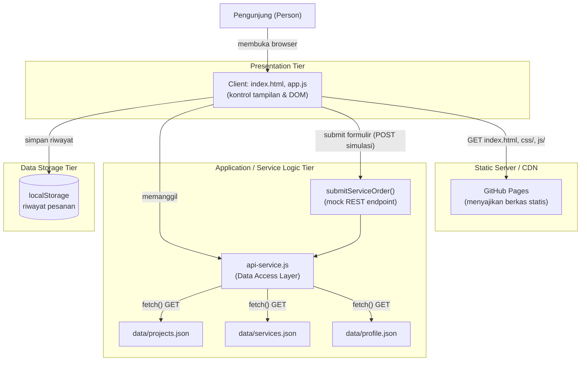

# Portofolio Silvia Eklesiana Sitorus — Minggu 4 (Arsitektur Decoupled & CSR)

Transformasi arsitektural dari **Personal Portfolio & Service Portal** Minggu 3 (Bootstrap 5,
data statis) menjadi aplikasi web ber-arsitektur **decoupled multi-tier**, dengan **Dynamic
Client-Side Rendering (CSR)**, untuk mata kuliah **Pemrograman dan Pengujian Aplikasi Web
(12S3101)**, Institut Teknologi Del.

Proyek ini adalah **refactoring**, dikembangkan di branch `week4-architecture` pada
repositori yang sama dengan Minggu 2 dan 3.

| | |
|---|---|
| **Nama** | Silvia Eklesiana Sitorus |
| **NIM** | 12S24004 |
| **Kelas** | S1 Sistem Informasi |
| **Live demo** | https://silviasitorus12.github.io/ppw-2026-week2-12S24004/ *(tampil setelah GitHub Pages diarahkan ke branch `week4-architecture`)* |
| **Repositori — branch Minggu 4** | https://github.com/SilviaSitorus12/ppw-2026-week2-12S24004/tree/week4-architecture |

## Diagram Arsitektur (C4 Container Model)


```mermaid
graph TD
  A["Pengunjung (Person)"] -->|membuka browser| B

  subgraph Presentation Tier
    B["Client: index.html, app.js<br/>(kontrol tampilan & DOM)"]
  end

  subgraph Static Server / CDN
    C["GitHub Pages<br/>(menyajikan berkas statis)"]
  end

  subgraph "Application / Service Logic Tier"
    D["api-service.js<br/>(Data Access Layer)"]
    E["data/projects.json"]
    F["data/services.json"]
    G["data/profile.json"]
    H["submitServiceOrder()<br/>(mock REST endpoint)"]
  end

  subgraph Data Storage Tier
    I[("localStorage<br/>riwayat pesanan")]
  end

  B -->|"GET index.html, css/, js/"| C
  B -->|memanggil| D
  D -->|"fetch() GET"| E
  D -->|"fetch() GET"| F
  D -->|"fetch() GET"| G
  B -->|"submit formulir (POST simulasi)"| H
  H --> D
  B -->|simpan riwayat| I
```

### Narasi Separation of Concerns

Ketiga lapisan dipisah agar masing-masing hanya bertanggung jawab pada satu hal:

- **Presentation Tier** (`app.js`) hanya mengurus tampilan — merender kartu, membuka modal,
  menampilkan status UI. Ia tidak tahu dan tidak peduli dari mana data berasal.
- **Application/Service Logic Tier** (`api-service.js` + berkas JSON) adalah satu-satunya
  bagian yang tahu cara mengambil data. Kalau suatu saat `projects.json` diganti dengan API
  sungguhan (mis. `https://api.contoh.com/projects`), cukup fungsi di dalam `api-service.js`
  yang berubah — `app.js` tidak perlu disentuh sama sekali, karena keduanya tetap
  berkomunikasi lewat bentuk data yang sama (Promise berisi array/objek JSON).
- **Data Storage Tier** (`localStorage`) menyimpan riwayat pesanan di perangkat pengunjung
  sendiri, terpisah dari data proyek yang sifatnya baca-saja (read-only).

Pemisahan ini disebut *decoupled* karena setiap lapisan bisa diganti secara independen tanpa
merombak lapisan lain — ciri utama arsitektur web kontemporer dibanding pendekatan monolitik
Minggu 2-3, yang menyatukan data dan tampilan dalam satu berkas HTML.

## Tabel Komparasi: Sebelum vs Sesudah Refactoring

| Aspek | Sebelum (Minggu 3 — Statis) | Sesudah (Minggu 4 — Dynamic CSR) |
|---|---|---|
| **Sumber data kartu proyek** | Ditulis langsung (hardcoded) di `index.html` | Dimuat dari `data/projects.json` lewat `fetch()` asinkron |
| **Jumlah modal** | 2 modal terpisah (GLOBORA, Imuniku) | **1 modal universal**, isinya diganti dinamis berdasarkan `data-project-id` |
| **Status antarmuka** | Tidak ada; kartu langsung tampil penuh | 4 status dikelola: Loading (skeleton), Success, Empty (filter kosong), Error (alert) |
| **Filter kategori** | Tidak ada | Tombol filter dibuat otomatis dari kategori unik di `projects.json`, filter instan tanpa reload |
| **Formulir** | Simulasi validasi saja, tidak benar-benar "terkirim" | Dikirim asinkron ke `ApiService.submitServiceOrder()`, umpan balik lewat **Bootstrap Toast**, tanpa reload halaman |
| **Riwayat pesanan** | Tidak disimpan | Disimpan ke `localStorage`, ditampilkan sebagai badge jumlah riwayat |
| **Keamanan** | Tidak relevan (data statis) | Setiap data yang dirender ke `innerHTML` melewati `escapeHTML()` untuk mencegah DOM-based XSS |
| **Struktur berkas** | `index.html`, `style.css` | `index.html`, `css/custom-style.css`, `data/*.json` (3 berkas), `js/api-service.js`, `js/app.js` |

## Profil Kinerja (DevTools Network)

> Diisi setelah situs live aktif. Buka DevTools (F12) → tab **Network**, muat halaman dua
> kali: sekali dengan cache dikosongkan (**Cold Load**, klik kanan tombol reload → *Empty
> Cache and Hard Reload*), sekali lagi dengan reload biasa (**Warm Load**).

| Metrik | Cold Load | Warm Load |
|---|---|---|
| Time to First Byte (TTFB) | *(isi, mis. 45 ms)* | *(isi)* |
| First Contentful Paint (FCP) | *(isi)* | *(isi)* |
| Jumlah request | *(isi)* | *(isi)* |
| Total ukuran transfer | *(isi)* | *(isi)* |
| Request dengan status `304 Not Modified` | 0 (belum ada cache) | *(isi jumlahnya)* |

**Screenshot waterfall:**

`screenshots/devtools-cold-load.png` dan `screenshots/devtools-warm-load.png`

*(Tempel gambarnya di folder `screenshots/` lalu tambahkan di sini dengan
``)*

## Pemenuhan Spesifikasi Tugas Minggu 4

| Area evaluasi (bobot) | Implementasi |
|---|---|
| **Pemodelan arsitektur (15%)** | Diagram C4 Container di atas (Mermaid), memetakan Client, Static Server/CDN, JSON Providers, dan mock REST endpoint, disertai narasi Separation of Concerns |
| **Dekomposisi data JSON (20%)** | `data/projects.json` (5 proyek, lengkap dengan `tags`, `metrics`, `thumbnail`, `link`), `data/services.json` (4 layanan), `data/profile.json` |
| **Dynamic CSR & UI States (25%)** | `index.html` bersih dari kartu hardcoded; rendering lewat `async/await`; 4 status (loading/success/empty/error) terkelola di `app.js`; filter kategori instan tanpa reload |
| **Modal universal (15%)** | Satu elemen `#universalProjectModal`; `openProjectModal(id)` menyuntik konten sesuai id; semua teks melalui `escapeHTML()` |
| **Formulir asinkron & state lokal (20%)** | `fetch`/Promise via `ApiService.submitServiceOrder()`, tombol submit nonaktif + spinner saat mengirim, umpan balik **Bootstrap Toast**, riwayat tersimpan di `localStorage` dan ditampilkan sebagai badge |
| **Profiling DevTools & Git (10%)** | Tabel dan screenshot di atas; branch `week4-architecture`; commit deskriptif |

## Struktur Folder

```
ppw-2026-week2-12S24004/            (repositori, branch week4-architecture)
├── index.html                      (shell bersih, tanpa kartu hardcoded)
├── css/
│   └── custom-style.css            (dari Minggu 3, ditambah gaya skeleton & toast)
├── data/
│   ├── profile.json
│   ├── projects.json
│   └── services.json
├── js/
│   ├── api-service.js              (Data Access Layer)
│   └── app.js                      (Presentation Layer)
├── assets/                         (dipakai bersama semua branch)
└── screenshots/
    └── devtools-*.png
```

## Menjalankan di Komputer Lokal

1. Clone repositori, lalu `git checkout week4-architecture`.
2. Buka folder di VS Code, klik kanan `index.html` → **Open with Live Server**.

**Penting:** karena `index.html` sekarang memuat data lewat `fetch()`, membukanya langsung
dengan cara *double-click* (protokol `file://`) **tidak akan berfungsi** — browser memblokir
`fetch()` ke berkas lokal atas alasan keamanan (kebijakan CORS). Harus lewat server lokal
seperti Live Server, bukan dibuka langsung dari File Explorer.

## Deployment

```bash
cd ppw-2026-week2-12S24004
git checkout -b week4-architecture
git add .
git commit -m "feat(week4): decouple architecture to json data providers and async CSR"
git push -u origin week4-architecture
```

Lalu **Settings → Pages → Branch: `week4-architecture` → Save**.

## Catatan

- Data pada `projects.json` dan `services.json` memuat beberapa angka (`metrics`, `priceLabel`)
  yang bersifat **contoh/placeholder** dan sebaiknya disesuaikan dengan data sebenarnya
  sebelum dikumpulkan.
- Formulir tetap **simulasi** di sisi server (`submitServiceOrder()` mengembalikan respons
  buatan setelah jeda 600ms), karena GitHub Pages tidak punya backend sungguhan. Yang nyata
  adalah **pola pengirimannya**: asinkron, tanpa reload, dengan status tombol dan Toast.
- Setiap data yang disuntikkan ke `innerHTML` (judul proyek, deskripsi, dsb.) melewati fungsi
  `escapeHTML()` di `app.js`, sebagai pertahanan lapis pertama terhadap DOM-based XSS, sesuai
  anjuran modul.

## Teknologi

HTML5, Bootstrap 5.3.3 (CDN), Bootstrap Icons, CSS3 kustom, JavaScript ES6+ (`fetch`,
`async/await`, modul IIFE), `localStorage`, Git, GitHub Pages.